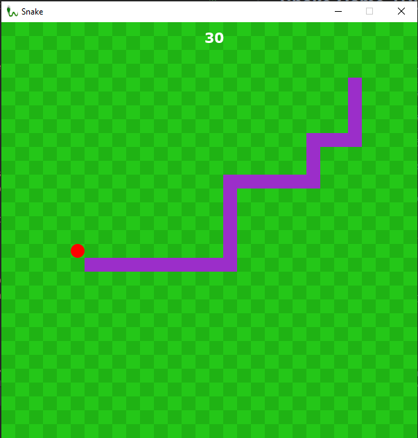

# Test Assignment 4


   
## Snake Game TDD



### Environment
| Name            | Version       |
|-----------------|--------------:|
| Java            | 17            |
| JavaFX (openFX) | 17            |
| Junit           | 5             | 
| TestFX          | 4             |

TestFX is a framework for Simple and clean testing of JavaFX Applications. 
If you want to know more, you can read about it here: 
[TestFX GitHub Repository](https://github.com/TestFX/TestFX) 

All dependencies are handled with maven and can be found in the pom.xml file in 
the root folder of this project. 

### Task
Create a snake game using TDD (Test-Driven-Development), it should include a
coverage report, mutation testing and static analysis. 

### Road Map 
All program files can be found in the ````src/main/java/dk/cosby/games/snaketdd/```` folder.
<br>All test files are divided into subfolders, the subfolders can be found here:
````src/main/test/dk/cosby/games/snaketdd````. 
<br>The subfolders contains integration tests in the ````integrationtest```` 
folder, unit tests in the ````unittest```` folder, and UI tests in the 
```uitest``` folder.   

A coverage report can be found in the ````coverage_report```` folder. 
It is in HTML format, so you will have to use some small static content 
server to navigate it.

A static analysis report can be found in the ````static_analysis```` folder. 
This is also in HTML format.

We have to be honest and say that the whole project has not been developed purely 
with tdd, we found it very hard to test the UI and did not know where to start, 
so we developed some of the application using TDD and other parts not so much.

We did not have time to make any mutation tests as well. 

### To run
1. Clone this repository
2. Run CLI ```mvn install``` in the root folder (where pom.xml is) or install maven dependencies through your IDE.
3. Run the ```Game.class``` located in ````src/main/java/dk/cosby/games/snaketdd/Game.java````


### Controls and game info

The snake moves from the instant you run the main class.

To control the snake use W,A,S,D keys. 
Pause/resume game with SPACE button. 

**RULES**
1. If the snakes head goes "outside" the window/stage size, it's game over.
2. If the snakes head touches its own body, it's game over.
3. Collect apples to get points. 

**OBS** There is no visual Game over screen, the game just stops. And when 
game is over, you have to close it and rerun the main class to play again. 
Needless to say, your highscore is not saved or recorded, take a screenshot 
when the game is over if you want to brag ;)

## Mockito Powerups
Answer the following questions about Mockito. Use code examples in your
explanations.

### **How do you verify that a mock was called?**

````verify(mockObject).someMethodOfMockObject(someArgument);````

This code verifies that *someMethodOfMockObject* was called.

### **How do you verify that a mock was NOT called?**

````verify(mockObject, Mockito.times(0)).someMethodOfMockObject(someArgument);````or
````verify(mockObject, Mockito.never()).someMethodOfMockObject(someArgument);````

This code verifies that *someMethodOfMockObject* was called 0 times which is the same as not calling it at all (never).


### **How do you specify how many times a mock should have been called?**

````verify(mockObject, Mockito.times(5)).someMethodOfMockObject(someArgument);````

This code verifies that *someMethodOfMockObject* was called 5 times.

### **How do you verify that a mock was called with specific arguments?**

All of the code examples above have *someArgument* passed in the method, which will verify the method with that parameter.

### **How do you use a predicate to verify the properties of the arguments given to a call to the mock?**

``` java
/* copied from https://www.javadoc.io/doc/org.mockito/mockito-core/2.2.9/org/mockito/ArgumentMatcher.html */
 
 class ListOfTwoElements implements ArgumentMatcher<List> {
     public boolean matches(List list) {
         return list.size() == 2; 
     }
     public String toString() {
         //printed in verification errors
         return "[list of 2 elements]";
     }
 }

 List mock = mock(List.class);

 when(mock.addAll(argThat(new ListOfTwoElements))).thenReturn(true);

 mock.addAll(Arrays.asList("one", "two"));

 verify(mock).addAll(argThat(new ListOfTwoElements()));
```
Mockito also accepts a lambda function syntax (java 8):
```
verify(mock).addAll(argThat(list -> list.size() == 2));
```
The code above makes it possible to use a predicate to verify the properties
of the arguments given to a call to the mock.
It is possible to use Java's build in Predicate class as well,
to do that you can read [this](https://newbedev.com/can-mockito-verify-an-argument-has-certain-properties-fields)
article from newbedev.com.  
